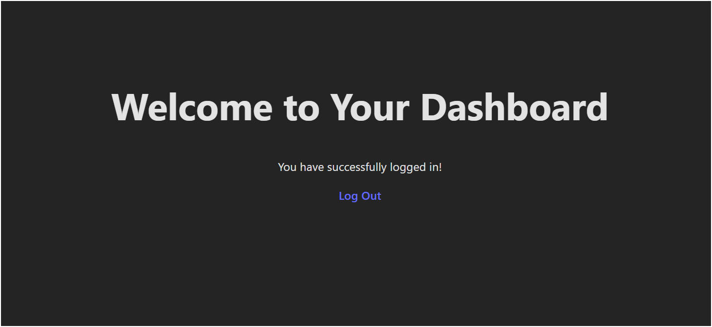

# React + Vite
Um formulário simples para o treinamento com react e node.js.
Mais funcionalizas mais tarde...

## Funcionalidades

- Login
- Criação de contas
- Salvamento dos dados no Mongo
- Bcrypt
- HASH e SALT 
- Responsividade
  
## Screenshots




## Variáveis de Ambiente
`Mongo URL = mongodb+srv://user:<db_password>@cluster0.ytlbu.mongodb.net/?retryWrites=true&w=majority&appName=Cluster0 `
`PORT(backend) = 5000`

## Rodando localmente
Clone o projeto

```bash
  git clone  https://github.com/Henrique1601/Forms_React_Node
```

Entre no diretório do projeto backend e frontend e Instale as dependências
```bash
  cd backend 
  npm install
```

Inicie o backend
```bash
    node node.js
    npm run dev
```

Inicie o frontend
```bash
    npm run start
```

## Stack utilizada

**Front-end:** HTML, CSS, JavaScript, React 
**Back-end:** Node.js, Express 
**Banco de dados** MongoDB


## Autores

- [@HenriqueBezerra](https://github.com/Henrique1601)